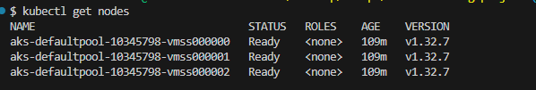
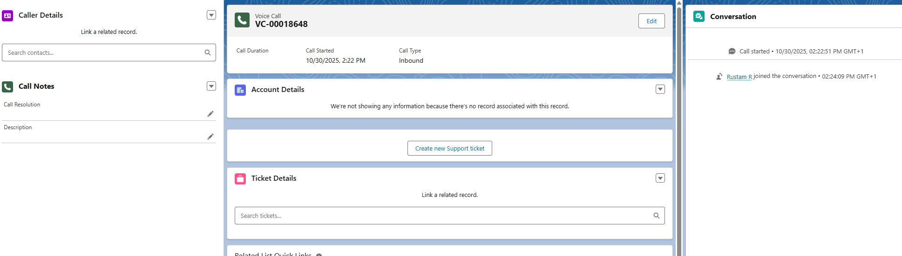
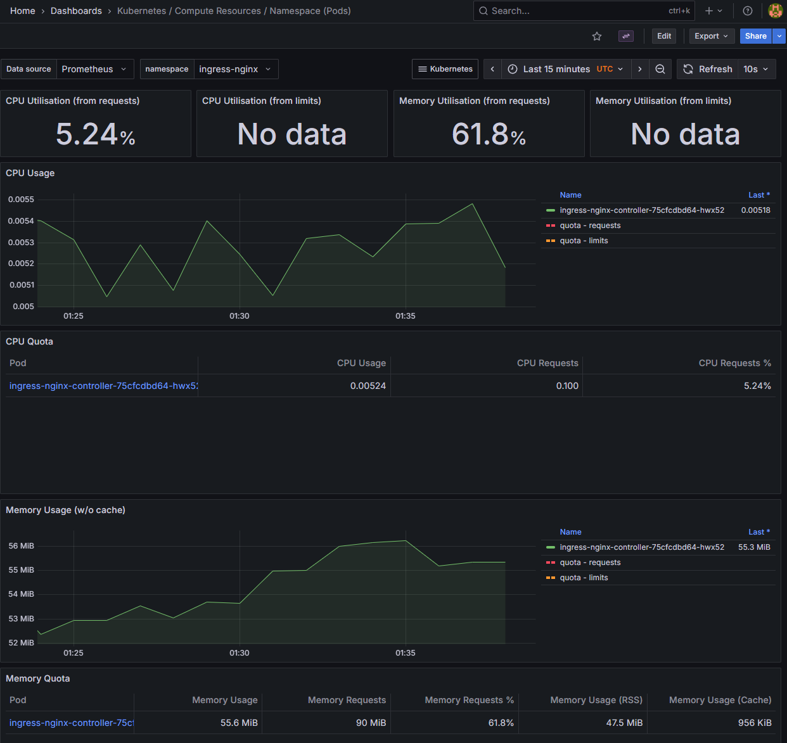

# AKS Cluster Provisioning with Terraform, Helm, and Prometheus

This project demonstrates a complete, production-style workflow for provisioning and monitoring a Kubernetes cluster on Azure.

The entire 3-node **Azure Kubernetes Service (AKS)** cluster is built using **Terraform (IaC)**. Then, **Helm** is used to deploy two essential services: the **NGINX Ingress Controller** and the full **kube-prometheus-stack** (Prometheus + Grafana).

The most valuable part of this project was the advanced troubleshooting required to integrate Prometheus with the NGINX Ingress Controller, which involved debugging `ServiceMonitor` selectors, namespaces, and metric port definitions.

## Project Goal

1.  Provision a reproducible, 3-node AKS cluster using **Terraform**.
2.  Install the **NGINX Ingress Controller** and **Prometheus/Grafana** stack using **Helm**.
3.  Solve the complex service discovery problem to make Prometheus scrape metrics from NGINX, even though they are in different namespaces.
4.  Prove the integration works by viewing both cluster-level (Node CPU/Mem) and application-level (NGINX pod health) metrics.

## Architecture Diagram

This diagram shows the final deployed architecture. Prometheus is configured to scan multiple namespaces to discover and scrape metrics from both its own stack and the NGINX controller.

```mermaid
graph TD
    subgraph "Azure Cloud (Managed by Terraform)"
        A[Resource Group]
        B(Log Analytics)
        C(AKS Cluster Control Plane)
        D(3x Virtual Machine Nodes)
        
        A --> B
        A --> C
        C --> D
        C -- Logs --> B
    end

    subgraph "Kubernetes Cluster (aks-cluster-prod)"
        
        subgraph "monitoring (Namespace)"
            F(Prometheus)
            G(Grafana)
            H(Alertmanager)
            J[K8s ServiceMonitor<br/>(nginx-manual-monitor)]
        end

        subgraph "ingress-nginx (Namespace)"
            E(NGINX Ingress Controller)
            I[K8s Service<br/>(ingress-nginx-controller-metrics)]
        end

        F -- Scrapes (Node) --> D
        F -- Discovers --> J
        J -- Selects --> I
        I -- Points to --> E
        G -- Queries --> F
    end

    K(DevOps Engineer) -- 1. terraform apply --> A
    K -- 2. helm install --> F
    K -- 3. helm install --> E
    K -- 4. kubectl apply --> J
    K -- 5. Accesses --> G

    ```


```markdown
## Core Technologies & Skills Demonstrated

* **Cloud:** Microsoft Azure (AKS, Log Analytics)
* **Infrastructure as Code (IaC):** Terraform
* **Orchestration:** Kubernetes
* **Package Management:** Helm
* **Monitoring & Observability:** Prometheus, Grafana
* **Networking: NGINX Ingress Controller
* **CLI Tools:** `kubectl`, Azure CLI
* **Security:** Azure Service Principal


## Project Screenshots

### 1. Cluster Verified (kubectl)


*`kubectl get nodes` output showing all 3 agent nodes are `Ready`.*

### 2. Prometheus Target (NGINX)


*The Prometheus UI (`/targets`) showing the `ingress-nginx-manual-monitor` target as **UP (green)**. This proves the complex service discovery and integration was successful.*

### 3. Grafana Dashboard (Node/Infrastructure Health)

*The Grafana "Compute Resources / Node (VMs)" dashboard, showing live CPU and Memory usage for the 3 cluster nodes.*

### 4. Grafana Dashboard (Pod/Application Health)

*The Grafana "Compute Resources / Namespace (Pods)" dashboard, filtered to the `ingress-nginx` namespace. This proves the NGINX controller pod is being successfully monitored for its CPU and Memory.*

## How It Works: From Code to Cluster

This project was built in a step-by-step process, culminating in a complex debugging challenge.

### 1. Infrastructure Provisioning (Terraform)
* **`main.tf`**: A Terraform file was created to define all Azure resources: `azurerm_resource_group`, `azurerm_log_analytics_workspace`, and the `azurerm_kubernetes_cluster`.
* **`terraform apply`**: This command provisioned the 3-node cluster, using a `SystemAssigned` identity for security and the `Standard_B2s` VM size for cost-effectiveness.

### 2. Cluster Connection (kubectl)
* **`az aks get-credentials`**: This command was used to download the cluster's `kubeconfig`, allowing the local `kubectl` CLI to connect and manage the new cluster.
* **`kubectl get nodes`**: This command verified that all 3 nodes were `Ready`.

### 3. Monitoring Stack Install (Helm)
* **`prometheus-values.yaml`**: A config file was created to tell the Prometheus stack to scan for `ServiceMonitors` in *all* namespaces, not just its own.
* **`helm install prometheus`**: The `kube-prometheus-stack` was installed into the `monitoring` namespace. This immediately provided node and cluster-level monitoring in Grafana.

### 4. NGINX Ingress Install (Helm)
* **`nginx-values.yaml`**: A config file was created to tell the NGINX chart to create its metrics `Service` with the specific labels and port name (`metrics`) that a `ServiceMonitor` would need to find.
* **`helm install ingress-nginx`**: The `ingress-nginx` chart was installed into the `ingress-nginx` namespace.

### 5. The Debugging & Integration (The "Real" Work)
* **Problem:** After installation, the NGINX metrics were missing from Prometheus.
* **Diagnosis (Step 1):** `kubectl get servicemonitor -n ingress-nginx` showed `No resources found`. The Helm chart had failed to create the "invitation" (`ServiceMonitor`).
* **Diagnosis (Step 2):** `kubectl describe prometheus...` showed that Prometheus was *also* looking for a specific label (`Release: prometheus`) that was not being applied.
* **Solution (Manual `ServiceMonitor`):** A manual YAML file, `nginx-servicemonitor.yaml`, was created. This file simultaneously:
    1.  Created the `ServiceMonitor` in the `monitoring` namespace (where Prometheus lives).
    2.  Added the required `Release: prometheus` label.
    3.  Set the selectors to find the NGINX metrics `Service` in the `ingress-nginx` namespace.
* **`kubectl apply -f nginx-servicemonitor.yaml`**: Applying this manual file instantly fixed the connection.

### 6. Final Verification
* **Prometheus:** The `ingress-nginx` target appeared as **`UP`** on the `/targets` page.
* **Grafana:** The "Compute Resources / Namespace (Pods)" dashboard successfully populated with both cluster *and* application (NGINX) health data.


## How to Clean Up

To destroy all resources and stop incurring costs, run the following commands:

```bash
# 1. Delete the manual ServiceMonitor
kubectl delete -f nginx-servicemonitor.yaml

# 2. Uninstall the Helm releases
helm uninstall prometheus --namespace monitoring
helm uninstall ingress-nginx --namespace ingress-nginx

# 3. Destroy all cloud infrastructure
terraform destroy